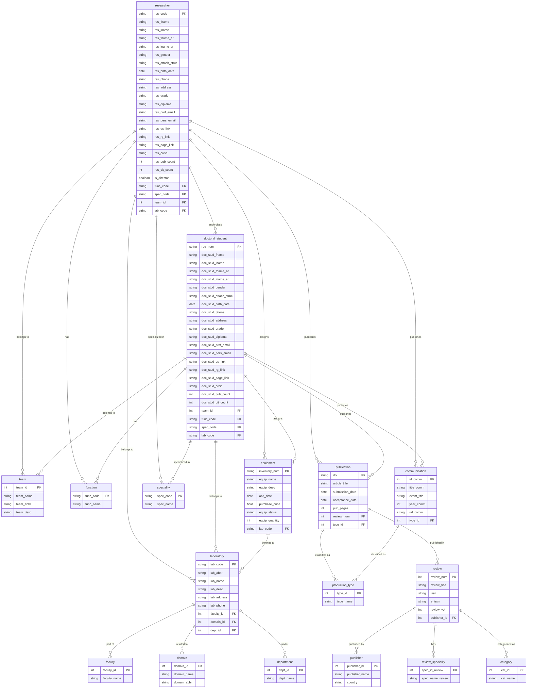

# 🌐 Integrated University Laboratory Management System

## 1. 📄 Abstract

The increase in the number of researchers, the expansion in allocated resources, and the constant evolution of research laboratories have made their management and monitoring increasingly complex. Indeed, the laboratories have become more numerous and their activities are more diversified. In addition, several material and human resources are allocated to these laboratories, hence the need to monitor these resources on a daily basis in order to enable the laboratories to accomplish their missions of training doctoral students, research, and innovation.

However, the following daily and periodic activities have become routine yet increasingly intricate:

- Identifying the skills and expertise of researchers affiliated with the laboratories.
- Managing researcher mobility and tracking their assignments.
- Census of scientific production and monitoring of its evolution by researcher or team to ensure its proper valuation.
- Managing allocated material resources, such as computer hardware, experimental equipment, instruments, and consumables.

This project proposes the design of an information system tailored to address these challenges. The system will provide decision-makers—such as lab directors, faculty members, and the university rectorate—with real-time monitoring of research laboratory activities. Its primary goal is to ensure the availability of up-to-date and comprehensive information on laboratory resources and operations.

The database at the core of this system will enable filtering of relevant information, facilitating informed decision-making by the university’s management. This solution aims to streamline laboratory management, optimize resource utilization, and enhance the overall efficiency of research operations.

## 2. 📚 Data dictionary
| N°  | Data Code               | Designation                                | Type/Size         | Empty        |
|-----|-------------------------|--------------------------------------------|-------------------|--------------|
| 01  | res_code                | Researcher code                            | Serial            | PRIMARY KEY, NOT NULL |
| 02  | res_fname               | Researcher first name                      | VARCHAR(50)       | NOT NULL     |
| 03  | res_lname               | Researcher last name                       | VARCHAR(50)       | NOT NULL     |
| 04  | res_fname_ar            | Researcher first name in Arabic            | VARCHAR(50)       | NOT NULL     |
| 05  | res_lname_ar            | Researcher last name in Arabic             | VARCHAR(50)       | NOT NULL     |
| 06  | res_gender              | Researcher gender                          | VARCHAR(10)       | NOT NULL     |
| 07  | res_attach_struc        | Researcher attachment structure            | VARCHAR(100)      | NULL         |
| 08  | res_birth_date          | Researcher birth date                      | Date              | NULL         |
| 09  | res_phone               | Researcher phone                           | VARCHAR(10)       | NULL         |
| 10  | res_address             | Researcher address                         | VARCHAR(250)      | NULL         |
| 11  | res_grade               | Researcher grade                           | VARCHAR(50)       | NULL         |
| 12  | res_diploma             | Researcher diploma                         | VARCHAR(50)       | NULL         |
| 13  | res_prof_email          | Researcher professional email              | VARCHAR(100)      | UNIQUE, NOT NULL |
| 14  | res_pers_email          | Researcher personal email                  | VARCHAR(100)      | UNIQUE, NULL |
| 15  | res_gs_link             | Researcher Google Scholar link             | VARCHAR(250)      | NULL         |
| 16  | res_rg_link             | Researcher ResearchGate link               | VARCHAR(250)      | NULL         |
| 17  | res_page_link           | Researcher personal page link              | VARCHAR(250)      | NULL         |
| 18  | res_orcid               | Researcher ORCID account                   | VARCHAR(39)       | UNIQUE, NULL |
| 19  | res_pub_count           | Researcher publications count              | INTEGER           | DEFAULT 0    |
| 20  | res_cit_count           | Researcher citations count                 | INTEGER           | DEFAULT 0    |
| 21  | is_director             | is director                                | BOOLEAN           | DEFAULT FALSE|
| 22  | team_id                 | Team identifier                            | Serial            | PRIMARY KEY, NOT NULL |
| 23  | team_name               | Team name                                  | VARCHAR(200)      | UNIQUE, NOT NULL |
| 24  | team_abbr               | Team abbreviation                          | VARCHAR(20)       | NULL         |
| 25  | team_desc               | Team description                           | TEXT              | NULL         |
| 26  | func_code               | Function code                              | Serial            | PRIMARY KEY, NOT NULL |
| 27  | func_name               | Function name                              | VARCHAR(100)      | UNIQUE, NOT NULL |
| 28  | faculty_id              | Faculty identifier                         | Serial            | PRIMARY KEY, NOT NULL |
| 29  | faculty_name            | Faculty name                               | VARCHAR(250)      | UNIQUE, NOT NULL |
| 30  | lab_code                | Laboratory code                            | Serial            | PRIMARY KEY, NOT NULL |
| 31  | lab_abbr                | Laboratory abbreviation                    | VARCHAR(20)       | NULL         |
| 32  | lab_name                | Laboratory name                            | VARCHAR(250)      | UNIQUE, NOT NULL |
| 33  | Lab_desc                | Laboratory description                     | TEXT              | NULL         |
| 34  | lab_address             | Laboratory address                         | VARCHAR(250)      | NULL         |
| 35  | lab_phone               | Laboratory phone                           | VARCHAR(9)        | NULL         |
| 36  | inventory_num           | Inventory number                           | VARCHAR(50)           | PRIMARY KEY, NOT NULL |
| 37  | equip_name              | Equipment name                             | TEXT              | NOT NULL     |
| 38  | equip_desc              | Equipment description                      | TEXT              | NULL         |
| 39  | acq_date                | Acquisition date                           | DATE              | NULL         |
| 40  | purchase_price          | Purchase price                             | NUMERIC(10,2)     | NULL         |
| 41  | equip_status            | Equipment status                           | VARCHAR(50)       | NULL         |
| 42  | equip_quantity          | Equipment Quantity                         | INTEGER           | NULL         |
| 43  | dept_id                 | Department identifier                      | Serial            | PRIMARY KEY, NOT NULL |
| 44  | dept_name               | Department name                            | VARCHAR(200)      | UNIQUE, NOT NULL |
| 45  | domain_id               | Domain identifier                          | Serial            | PRIMARY KEY, NOT NULL |
| 46  | domain_name             | Domain name                                | VARCHAR(200)      | UNIQUE, NOT NULL |
| 47  | domain_abbr             | Domain abbreviation                        | VARCHAR(20)       | NULL         |
| 48  | spec_code               | Specialty code                             | Serial            | PRIMARY KEY, NOT NULL |
| 49  | spec_name               | Specialty name                             | VARCHAR(100)      | UNIQUE, NOT NULL |
| 50  | doi                     | Digital object identifier                  | VARCHAR(50)       | PRIMARY KEY, NOT NULL |
| 51  | article_title           | Article title                              | VARCHAR(200)      | NOT NULL     |
| 52  | submission_date         | Submission date                            | Date              | NOT NULL     |
| 53  | acceptance_date         | Acceptance date                            | Date              | NOT NULL     |
| 54  | pub_pages               | Publication pages                          | VARCHAR(10)       | NULL         |
| 55  | id_comm                 | Communication identifier                   | Serial            | PRIMARY KEY, NOT NULL |
| 56  | title_comm              | Communication title                        | VARCHAR(150)      | UNIQUE, NOT NULL |
| 57  | event_title             | Event title                                | VARCHAR(150)      | NOT NULL     |
| 58  | year_comm               | Communication year                         | DATE              | NOT NULL     |
| 59  | url_comm                | Communication url                          | VARCHAR(250)      | NULL         |
| 60  | type_id                 | Type identifier                            | Serial            | PRIMARY KEY, NOT NULL |
| 61  | type_name               | Type name                                  | VARCHAR(100)      | UNIQUE, NOT NULL |
| 62  | reg_num                 | Registration number                        | INTEGER(12)       | PRIMARY KEY, NOT NULL |
| 63  | doc_stud_fname          | Doctoral student first name                | VARCHAR(50)       | NOT NULL     |
| 64  | doc_stud_lname          | Doctoral student last name                 | VARCHAR(50)       | NOT NULL     |
| 65  | doc_stud_fname_ar       | Doctoral student first name in Arabic      | VARCHAR(50)       | NOT NULL     |
| 66  | doc_stud_lname_ar       | Doctoral student last name in Arabic       | VARCHAR(50)       | NOT NULL     |
| 67  | doc_stud_gender         | Doctoral student gender                    | VARCHAR(10)       | NOT NULL     |
| 68  | doc_stud_attach_struc   | Doctoral student attachment structure      | VARCHAR(100)      | NULL         |
| 69  | doc_stud_birth_date     | Doctoral student birth date                | Date              | NULL         |
| 70  | doc_stud_phone          | Doctoral student phone                     | VARCHAR(10)       | NULL         |
| 71  | doc_stud_address        | Doctoral student address                   | VARCHAR(250)      | NULL         |
| 72  | doc_stud_grade          | Doctoral student grade                     | VARCHAR(50)       | NULL         |
| 73  | doc_stud_diploma        | Doctoral student diploma                   | VARCHAR(50)       | NULL         |
| 74  | doc_stud_prof_email     | Doctoral student professional email        | VARCHAR(100)      | UNIQUE, NOT NULL |
| 75  | doc_stud_pers_email     | Doctoral student personal email            | VARCHAR(100)      | UNIQUE, NULL |
| 76  | doc_stud_gs_link        | Doctoral student Google Scholar link       | VARCHAR(250)      | NULL         |
| 77  | doc_stud_rg_link        | Doctoral student ResearchGate link         | VARCHAR(250)      | NULL         |
| 78  | doc_stud_page_link      | Doctoral student personal page link        | VARCHAR(250)      | NULL         |
| 79  | doc_stud_orcid          | Doctoral student ORCID account             | VARCHAR(39)       | UNIQUE, NULL |
| 80  | doc_stud_pub_count      | Doctoral student publications count        | INTEGER           | DEFAULT 0    |
| 81  | doc_stud_cit_count      | Doctoral student citations count           | INTEGER           | DEFAULT 0    |
| 82  | publisher_id            | Publisher identifier                       | Serial            | PRIMARY KEY, NOT NULL |
| 83  | publisher_name          | Publisher name                             | VARCHAR(50)       | UNIQUE, NOT NULL |
| 84  | country                 | Country                                    | VARCHAR(50)       | NULL         |
| 85  | review_num              | Review number                              | Serial            | PRIMARY KEY, NOT NULL |
| 86  | review_title            | Review title                               | VARCHAR(200)      | NOT NULL     |
| 87  | issn                    | International Standard Serial Number       | VARCHAR(9)       | UNIQUE, NOT NULL |
| 88  | e_issn                  | Electronic International Standard Serial Number | VARCHAR(9) | UNIQUE, NULL |
| 89  | review_vol              | Review volume                              | INTEGER           | NULL         |
| 90  | spec_id_review          | Specialty identifier review                | Serial            | PRIMARY KEY, NOT NULL |
| 91  | spec_name_review        | Specialty name review                      | VARCHAR(100)      | UNIQUE, NOT NULL |
| 92  | cat_id                  | Category identifier                        | Serial            | PRIMARY KEY, NOT NULL |
| 93  | cat_name                | Category name                              | VARCHAR(100)      | UNIQUE, NOT NULL |
| 94  | res_assign_date         | Researcher assign date                     | DATE              | NOT NULL     |
| 95  | res_return_date         | Researcher return date                     | DATE              | NULL         |
| 96  | super_start_date        | Supervision start date                     | DATE              | NOT NULL     |
| 97 | super_end_date           | Supervision end date                       | DATE              | NULL         |
| 98 | super_theme             | Supervision theme                          | VARCHAR(250)      | NOT NULL     |
| 99 | doc_stud_assign_date    | Doctoral student assign date               | DATE              | NOT NULL     |
| 100 | doc_stud_return_date    | Doctoral student return date               | DATE              | NULL         |

## 3. 🧠 Database Conceptual Model (MCD)

## 4. 🏗️ Data Logical Model (MLD)

**researcher** (*res_code*, res_fname, res_lname, res_fname_ar, res_lname_ar, res_gender, res_attach_struc, res_birth_date, res_phone, res_address, res_grade, res_diploma, res_prof_email, res_pers_email, res_gs_link, res_rg_link, res_page_link, res_orcid, res_pub_count, res_cit_count, is_director, #func_code, #spec_code, #team_id, #lab_code).

**team** (*team_id*, team_name, team_abbr, team_desc).

**function** (*func_code*, func_name).

**faculty** (*faculty_id*, faculty_name).

**laboratory** (*lab_code*, lab_abbr, lab_name, lab_desc, lab_address, lab_phone, #faculty_id, #domain_id, #dept_id).

**equipment** (*inventory_num*, equip_name, equip_desc, acq_date, purchase_price, equip_status, equip_quantity, #lab_code).

**department** (*dept_id*, dept_name).

**domain** (*domain_id*, domain_name, domain_abbr).

**specialty** (*spec_code*, spec_name).

**publication** (*doi*, article_title, submission_date, acceptance_date, pub_pages, #review_num, #type_id).

**communication** (*id_comm*, title_comm, event_title, year_comm, url_comm, #type_id)

**production_type** (*type_id*, type_name).

**doctoral_student** (*reg_num*, doc_stud_fname, doc_stud_lname, doc_stud_fname_ar, doc_stud_lname_ar, doc_stud_gender, doc_stud_attach_struc, doc_stud_birth_date, doc_stud_phone, doc_stud_address, doc_stud_grade, doc_stud_diploma, doc_stud_prof_email, doc_stud_pers_email, doc_stud_gs_link, doc_stud_rg_link, doc_stud_page_link, doc_stud_orcid, doc_stud_pub_count, doc_stud_cit_count, #team_id, #func_code, #spec_code, #lab_code).

**publisher** (*publisher_id*, publisher_name, country).

**review** (*review_num*, review_title, issn, e_issn, review_vol, #publisher_id).

**review_speciality** (*spec_id_review*, spec_name_review).

**category** (*cat_id*, cat_name).

**assign_researcher** (*res_code*, *inventory_num*, res_assign_date, res_return_date).

**publish_researcher_pub** (*res_code*, *doi*).

**publish_researcher_comm** (*res_code*, *id_comm*)

**supervise** (*res_code*, *reg_num*, super_start_date, super_end_date, super_theme).

**publish_doctoral_student_pub** (*reg_num*, *doi*).

**publish_doctoral_student_comm** (*reg_num*, *id_comm*)

**has_specialty** (*review_num*, *spec_id_review*).

**has_category** (*review_num*, *cat_id*).

**assign_doctoral_student** (*reg_num*, *inventory_num*, doc_stud_assign_date, doc_stud_return_date).

## 5. 🤝 Contributing 
Contributions are welcome! Please follow these steps: 
1. Fork the repository. 
2. Create a new branch (git checkout -b feature/YourFeatureName).
3. Commit your changes (git commit -m 'Add some feature').
4. Push to the branch (git push origin feature/YourFeatureName).
5. Open a pull request.

## 6. 📜 license
This project was developed by *Boukherouba Raid* as a Licentiate project at the University of *8 Mai 1945 Guelma* in 2022 and was updated in 2025. It is licensed under the MIT License. See the [LICENSE](./LICENSE) file for details.

## 7. 📧 Contact
For questions or feedback, please contact: 
- ✉️ Gmail: raidboukherouba@gmail.com
- 🐙 GitHub: raidboukherouba